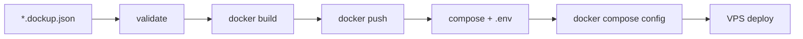

# dockup

**Professional Docker deploy CLI.** Build images, push to a registry, and generate production-ready Docker Compose artifacts from a declarative `*.dockup.json` config.

[](https://github.com/rpjax/npm-dockup/actions/workflows/ci.yml)

**Package:** `@rodrigopjax/dockup` · **Binary:** `dockup` · **Node:** `>=18` · **License:** MIT

---

## Table of contents

- [Agent reference (complete capability map)](#agent-reference-complete-capability-map)
- [What dockup does](#what-dockup-does)
- [Install](#install)
- [Quick start](#quick-start)
- [Commands and flags](#commands-and-flags)
- [Deploy pipeline](#deploy-pipeline)
- [Output modes](#output-modes)
- [Exit codes and JSON API](#exit-codes-and-json-api)
- [Configuration (`*.dockup.json`)](#configuration-dockupjson)
- [Environment interpolation](#environment-interpolation)
- [Image naming and registries](#image-naming-and-registries)
- [Generated artifacts](#generated-artifacts)
- [Validation rules](#validation-rules)
- [Common workflows](#common-workflows)
- [CI integration](#ci-integration)
- [Project layout for agents](#project-layout-for-agents)
- [Troubleshooting](#troubleshooting)
- [Further documentation](#further-documentation)
- [Development](#development)
- [License](#license)

---

## Agent reference (complete capability map)

> **For AI agents:** this section is the authoritative summary. After reading it, you should know every command, flag, config field, pipeline phase, output format, and constraint — without reading source code.

### Identity

| Property | Value |
| -------- | ----- |
| npm package | `@rodrigopjax/dockup` |
| CLI binary | `dockup` |
| Config file pattern | exactly one `*.dockup.json` per working directory (or `--config <path>`) |
| Config suffix | `.dockup.json` (files like `app.dockup.example.json` are **ignored**) |
| JSON Schema | `schema/dockup.schema.json` (shipped in npm package) |
| Build output | `out/<env>/docker-compose.yml` + `out/<env>/.env` |

### Commands

| Command | Requires Docker | Purpose |
| ------- | --------------- | ------- |
| `dockup init [name]` | No | Create `<name>.dockup.json` from minimal template (default name: `app`) |
| `dockup validate [options]` | No | JSON Schema + semantic validation + `${VAR}` resolution |
| `dockup deploy --env <name> [options]` | Yes | Full pipeline: validate → preflight → build → push → generate → `docker compose config` |

### Global flags (work on root and subcommands; can appear before or after subcommand)

| Flag | Short | Default | Effect |
| ---- | ----- | ------- | ------ |
| `--config <path>` | `-c` | auto-discover | Explicit path to `*.dockup.json` |
| `--root <path>` | `-r` | `.` | Repository root for resolving `container.context` build paths |
| `--json` | | off | Structured JSON on stdout; suppresses banners and listr2 |
| `--quiet` | `-q` | off | Errors and warnings only; no listr2, no summary |
| `--verbose` | `-v` | off | Debug logging |
| `--version` | `-V` | | Print version from `package.json` |
| `--help` | `-h` | | Commander-generated help |

### Deploy-only flags

| Flag | Effect |
| ---- | ------ |
| `--env <name>` **(required)** | Environment key at root of config JSON (e.g. `prod`, `dev`) |
| `--only <id>` | Build/push only one container by `id` |
| `--skip-build` | Skip `docker build` phase |
| `--skip-push` | Skip `docker push` phase |
| `--generate-only` | Sets both `--skip-build` and `--skip-push`; only generates compose artifacts |
| `--dry-run` | Log docker commands without executing them |

### Deploy pipeline phases (in order)

1. **Config** — JSON Schema + semantic validation for target env only
2. **Preflight** — `docker version`, `docker info`, registry auth check (warns if missing)
3. **Build** — `docker build` per container that has `context` (skipped if `--skip-build` or no context)
4. **Push** — `docker push` per built image (skipped if `--skip-push` or no context)
5. **Generate** — write `out/<env>/docker-compose.yml` and `.env`
6. **Validate compose** — `docker compose config` on generated files

Containers **without** `context` are skipped for build/push (image-only services).

### Config root structure

Root JSON object: `{ "<envName>": { ... }, ... }`. Each environment:

| Field | Required | Description |
| ----- | -------- | ----------- |
| `namespace` | **yes** | Docker image namespace (e.g. `myorg`) |
| `network` | **yes** | Docker Compose network name (no default) |
| `tag` | no | Image tag; defaults to environment key name |
| `registry` | no | Registry host prefix (e.g. `ghcr.io`) |
| `env` | no | Symbol table for `${VAR}` interpolation; supports `global: true` |
| `containers` | **yes** | Non-empty array of container definitions |

Each container:

| Field | Required | Description |
| ----- | -------- | ----------- |
| `id` | **yes** | Service name (unique within env); becomes Compose service key and `container_name` |
| `image` | **yes** | Image name without registry/namespace |
| `context` | no | Build context path relative to `--root`; omit for pull-only services |
| `dockerfile` | no | Default `Dockerfile` inside context |
| `env` | no | Runtime env vars; values interpolate against environment symbols |
| `buildArgs` | no | Docker build args; requires `context`; interpolate against env symbols |
| `ports` | no | `[{ "host": 8080, "container": 80 }]` |
| `expose` | no | Internal ports array |
| `volumes` | no | Named (`name`+`container`) or bind (`host`+`container`) mounts |
| `dependsOn` | no | Array of container `id` strings |

### Interpolation rules

- Syntax: `${SYMBOL_NAME}` (letters, digits, underscore; must start with letter or `_`)
- Environment `env[]` defines symbols; supports chaining (`"value": "http://${HOST}"`)
- `global: true` on environment env entry injects into **every** container at runtime
- Container `env[]` and `buildArgs[]` resolve against environment symbols only (not other containers)
- Circular references and missing symbols → validation error

### Image reference format

```
<registry>/<namespace>/<image>:<tag>   # when registry is set
<namespace>/<image>:<tag>             # when registry is omitted
```

Compose services use: `${DOCKER_IMAGE_ROOT}/<image>:${DOCKER_TAG}` where `.env` sets:

```
DOCKER_IMAGE_ROOT=<registry>/<namespace> or <namespace>
DOCKER_TAG=<tag>
```

### Exit codes

| Code | Phases | Meaning |
| ---- | ------ | ------- |
| `0` | — | Success |
| `1` | `CLI`, `CONFIG`, `GENERATE` | Invalid args, config, or compose generation |
| `2` | `PREFLIGHT`, `BUILD`, `PUSH`, `VALIDATE` | Docker command failure |
| `3` | `RUNTIME` | Unexpected error |

### JSON success shapes

**validate:**
```json
{ "ok": true, "command": "validate", "config": "...", "configDir": "...", "repoRoot": "...", "environments": ["prod", "dev"] }
```

**deploy:**
```json
{ "ok": true, "command": "deploy", "env": "prod", "namespace": "...", "registry": "ghcr.io", "tag": "prod", "built": ["api"], "pushed": ["api"], "artifacts": ["out/prod/docker-compose.yml", "out/prod/.env"], "elapsedSec": 42.1 }
```

**init:**
```json
{ "ok": true, "command": "init", "path": "/path/to/myapp.dockup.json" }
```

### JSON failure shape

```json
{ "ok": false, "phase": "CONFIG", "message": "...", "hint": "...", "detail": "...", "cause": "..." }
```

Use `--json` on root **or** subcommand; both work for success and failure.

### Hard constraints (will fail validation)

- Zero or multiple `*.dockup.json` in cwd without `--config`
- Duplicate container `id` in same environment
- `buildArgs` without `context`
- `dependsOn` referencing unknown container id
- Missing build context directory or Dockerfile on disk (when `context` is set)
- Unresolved or circular `${VAR}` references
- Unknown `--env` name

### What dockup does NOT do

- Does not run `docker compose up` on the target server
- Does not manage secrets beyond reading local `~/.docker/config.json` for auth warnings
- Does not support legacy `*.deploy.json` or `env=prod` syntax (see [docs/migration-v1.md](docs/migration-v1.md))
- Does not auto-detect config outside cwd (must pass `--config` or run from config directory)

---

## What dockup does

dockup turns a **declarative JSON config** into a **repeatable deploy pipeline**:

```
*.dockup.json  →  docker build  →  docker push  →  out/<env>/  →  VPS: docker compose up
```

**Typical use case:** a monorepo with multiple services, multiple environments (`dev`, `staging`, `prod`), and a CI job that builds, pushes to `ghcr.io`, and produces compose files ready to copy to a VPS.



---

## Install

```bash
npm install -g @rodrigopjax/dockup
```

Or run without installing:

```bash
npx @rodrigopjax/dockup --help
```

---

## Quick start

```bash
# 1. Scaffold config
dockup init myapp
# → creates myapp.dockup.json

# 2. Edit myapp.dockup.json (add contexts, registry, env vars)

# 3. Validate (no Docker required)
dockup validate

# 4. Deploy one environment
dockup deploy --env prod
```

**Output on VPS:**

```
out/prod/
  docker-compose.yml
  .env
```

Copy to server and run:

```bash
docker compose pull && docker compose up -d
```

---

## Commands and flags

Built-in help (Commander):

```bash
dockup --help
dockup deploy --help
dockup validate --help
dockup init --help
```

### `dockup init [name]`

Creates `<name>.dockup.json` from the minimal template. Default name: `app`.

```bash
dockup init              # → app.dockup.json
dockup init myapp        # → myapp.dockup.json
dockup init svc --json   # JSON output
```

Fails with exit `1` if the file already exists.

### `dockup validate`

Validates config without Docker. Checks JSON Schema, semantics, path existence, and `${VAR}` resolution.

```bash
dockup validate                                    # all environments
dockup validate --env prod                         # one environment
dockup validate --config ./deploy/app.dockup.json
dockup --json validate --config ./app.dockup.json  # global flags before subcommand
```

### `dockup deploy --env <name>`

Full pipeline. **`--env` is required.**

```bash
dockup deploy --env prod
dockup deploy --env dev --only api
dockup deploy --env prod --generate-only --root .
dockup deploy --env prod --config ./deploy/app.dockup.json --dry-run
dockup deploy --env prod --skip-build --skip-push   # generate only (same as --generate-only)
```

---

## Deploy pipeline

Interactive mode (default) shows a **listr2** task tree:

```
◼ Config
◼ Preflight
◼ Build
  ◼ api
  ◼ web
◼ Push
  ◼ api
  ◼ web
◼ Generate
◼ Validate compose
```

**Preflight checks:**

- Docker CLI available (`docker version`)
- Docker daemon reachable (`docker info`)
- Registry credentials in `~/.docker/config.json` (warning only if missing)
- Logs working directory, config path, and repository root

**Build:** runs from `--root` + `container.context`. Docker stdout is inherited (live build logs).

**Generate:** produces Compose v3-style YAML with services, networks, and named volumes.

**Validate compose:** runs `docker compose config` to catch invalid generated YAML.

---

## Output modes

| Mode | Flag | Behavior |
| ---- | ---- | -------- |
| Interactive (default) | — | listr2 task tree + brief completion message |
| JSON | `--json` | Single JSON object on stdout; no banner, no listr2 |
| Quiet | `--quiet` | Errors/warnings only; no banner, no listr2, no summary |
| Verbose | `--verbose` | Debug log lines |
| Dry run | `--dry-run` | Logs docker commands with `[dry-run]` prefix |

---

## Exit codes and JSON API

| Code | Meaning |
| ---- | ------- |
| `0` | Success |
| `1` | CLI, config, or compose generation error |
| `2` | Docker command failed (includes preflight) |
| `3` | Unexpected runtime error |

**CI pattern:**

```bash
dockup validate --json | jq -e '.ok'
dockup deploy --env prod --json | jq -e '.ok'
```

**Failure example:**

```json
{
  "ok": false,
  "phase": "CONFIG",
  "message": "Environment \"prod\" resolution failed: Unresolved symbol \"MISSING\".",
  "hint": null,
  "detail": null,
  "cause": null
}
```

---

## Configuration (`*.dockup.json`)

### Discovery

| Matches in cwd | Result |
| -------------- | ------ |
| 0 | Error — run `dockup init` or pass `--config` |
| 1 | Uses that file |
| 2+ | Error — ambiguous; pass `--config` |

### Minimal example

```json
{
  "prod": {
    "namespace": "myorg",
    "network": "myapp",
    "containers": [
      {
        "id": "api",
        "image": "my-api",
        "context": "services/api",
        "env": [{ "name": "NODE_ENV", "value": "production" }]
      }
    ]
  }
}
```

### Multi-environment example

```json
{
  "dev": {
    "namespace": "myorg",
    "network": "myapp-dev",
    "env": [
      { "name": "API_HOST", "value": "api.localhost" },
      { "name": "API_BASE_URL", "value": "http://${API_HOST}" }
    ],
    "containers": [
      {
        "id": "api",
        "image": "my-api",
        "context": "services/api",
        "env": [{ "name": "NODE_ENV", "value": "development" }]
      }
    ]
  },
  "prod": {
    "namespace": "myorg",
    "network": "myapp",
    "registry": "ghcr.io",
    "tag": "prod",
    "containers": [
      {
        "id": "api",
        "image": "my-api",
        "context": "services/api",
        "env": [{ "name": "NODE_ENV", "value": "production" }]
      }
    ]
  }
}
```

### Full-stack example (gateway + api + web)

See [`examples/full-stack.dockup.json`](examples/full-stack.dockup.json) and [`examples/full-stack/`](examples/full-stack/) for ports, `dependsOn`, `buildArgs`, and multi-registry setup.

### VS Code autocomplete

```json
{
  "json.schemas": [
    {
      "fileMatch": ["*.dockup.json"],
      "url": "./node_modules/@rodrigopjax/dockup/schema/dockup.schema.json"
    }
  ]
}
```

Formal schema: [`schema/dockup.schema.json`](schema/dockup.schema.json)

---

## Environment interpolation

1. **Environment-level `env[]`** defines a symbol table. Values can reference other symbols: `"http://${API_HOST}"`.
2. **`global: true`** on an environment env entry injects that variable into **every** container at runtime.
3. **Container `env[]`** values interpolate against environment symbols only.
4. **`buildArgs[]`** resolve against environment symbols only (requires `context`).

**Valid:**

```json
"env": [
  { "name": "HOST", "value": "api.example.com" },
  { "name": "URL", "value": "https://${HOST}" },
  { "name": "LOG_LEVEL", "value": "info", "global": true }
]
```

**Invalid:** missing symbol, circular chain (`A → B → A`), `global` on container env.

---

## Image naming and registries

| Config | Image built/pushed | `DOCKER_IMAGE_ROOT` in `.env` |
| ------ | ------------------ | ----------------------------- |
| `namespace: "myorg"`, no registry | `myorg/my-api:prod` | `myorg` |
| `namespace: "myorg"`, `registry: "ghcr.io"` | `ghcr.io/myorg/my-api:prod` | `ghcr.io/myorg` |

Compose service image line:

```yaml
image: ${DOCKER_IMAGE_ROOT}/my-api:${DOCKER_TAG}
```

---

## Generated artifacts

```
out/<env>/
  docker-compose.yml    # services, networks, volumes
  .env                  # DOCKER_IMAGE_ROOT, DOCKER_TAG
```

Each service gets:

- `image` from env vars above
- `container_name` = container `id`
- `restart: unless-stopped`
- `networks`, `ports`, `expose`, `environment`, `volumes`, `depends_on` as configured

---

## Validation rules

Beyond JSON Schema, dockup enforces:

- `namespace` and `network` required per environment
- Unique container `id` per environment
- Valid `dependsOn` references
- `buildArgs` requires `context`
- Build context directory and Dockerfile exist on disk (relative to `--root`)
- All `${VAR}` symbols resolve without cycles
- No duplicate env/buildArg names within same scope
- `global` flag only allowed on environment-level `env[]`

`dockup validate` runs all checks without Docker. `dockup deploy` re-validates the target environment before building.

---

## Common workflows

### Local dev — generate compose only

```bash
dockup deploy --env dev --generate-only
```

### CI — build, push, artifact upload

```bash
dockup validate --config deploy/app.dockup.json --json
dockup deploy --env prod --config deploy/app.dockup.json --json
# upload out/prod/ as CI artifact
```

### Single service rebuild

```bash
dockup deploy --env prod --only api
```

### Preview docker commands

```bash
dockup deploy --env prod --dry-run
```

### Monorepo with config in subdirectory

```bash
dockup deploy --env prod --config deploy/app.dockup.json --root .
```

`--root` is where `services/api`, `services/web`, etc. resolve from.

---

## CI integration

**Validate on every PR** (no Docker):

```yaml
- run: npx @rodrigopjax/dockup validate --config app.dockup.json --root . --json
```

**Deploy job:**

```yaml
- uses: docker/login-action@v3
  with:
    registry: ghcr.io
    username: ${{ github.actor }}
    password: ${{ secrets.GITHUB_TOKEN }}
- run: npx @rodrigopjax/dockup deploy --env prod --config deploy/app.dockup.json --json
- uses: actions/upload-artifact@v4
  with:
    name: compose-prod
    path: out/prod/
```

Full examples: [docs/ci.md](docs/ci.md)

---

## Project layout for agents

When integrating dockup into a user project, expect this layout:

```
my-project/
  app.dockup.json          # or myapp.dockup.json — exactly one per deploy cwd
  services/
    api/
      Dockerfile
      ...
    web/
      Dockerfile
      ...
  out/                     # generated (gitignore recommended)
    prod/
      docker-compose.yml
      .env
```

**Agent checklist before running deploy:**

1. Confirm exactly one `*.dockup.json` or pass `--config`
2. Confirm `--env` key exists in config root
3. Confirm `--root` resolves all `container.context` paths
4. Confirm Docker is installed and logged into registry (for push)
5. Use `--json` in CI for machine-parseable results
6. Use `--generate-only` when user only needs compose files without registry access

---

## Troubleshooting

| Problem | Cause | Fix |
| ------- | ----- | --- |
| `No *.dockup.json config found` | No config in cwd | `dockup init` or `--config <path>` |
| `Ambiguous config` | Multiple `*.dockup.json` files | Remove extras or `--config` |
| `buildArgs but no build context` | `buildArgs` without `context` | Add `context` or remove `buildArgs` |
| `Unresolved symbol` | `${VAR}` not in environment `env[]` | Define symbol at environment level |
| `Build context not found` | Wrong `--root` or path | Fix `context` or pass `--root` |
| Push fails | Not logged into registry | `docker login ghcr.io` (or your registry) |
| Human errors in CI with `--json` | Flag placement | Use `--json` on root or subcommand (both work) |

---

## Further documentation

| Doc | Contents |
| --- | -------- |
| [docs/cli.md](docs/cli.md) | Full CLI flag reference |
| [docs/config.md](docs/config.md) | Configuration deep dive |
| [docs/ci.md](docs/ci.md) | GitHub Actions patterns |
| [docs/migration-v1.md](docs/migration-v1.md) | Upgrade from legacy v0.x syntax |
| [CHANGELOG.md](CHANGELOG.md) | Version history |
| [examples/](examples/) | Minimal and full-stack configs |

---

## Development

```bash
git clone https://github.com/rpjax/npm-dockup.git
cd npm-dockup
npm ci
npm test        # build + 36 tests + lint
npm run lint
```

## Release

Published to npm on semver tag push:

```bash
git tag v1.1.0
git push origin v1.1.0
```

Requires `NPM_TOKEN` secret in GitHub repository settings.

---

## License

MIT — see [LICENSE](LICENSE).
